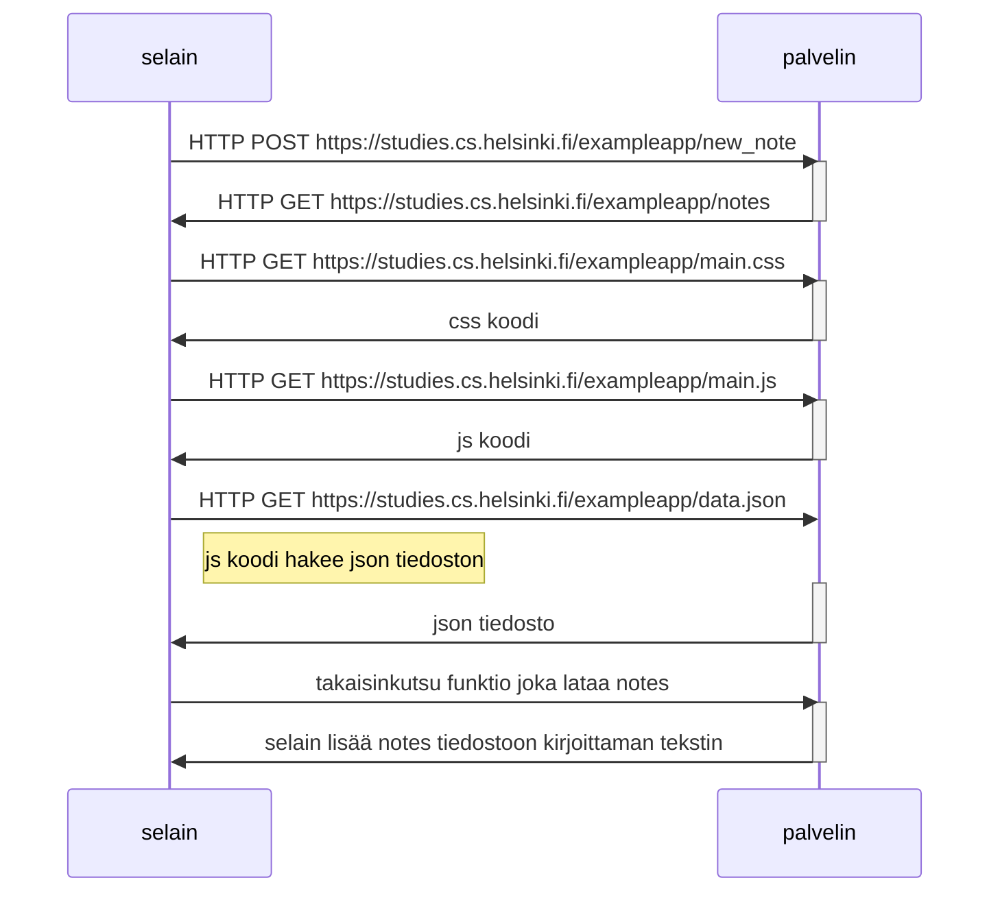

```mermaid
sequenceDiagram
participant selain
participant palvelin

    selain->>palvelin: HTTP POST https://studies.cs.helsinki.fi/exampleapp/new_note
    activate palvelin
    palvelin->>selain: HTTP GET https://studies.cs.helsinki.fi/exampleapp/notes
    deactivate palvelin

    selain->>palvelin: HTTP GET https://studies.cs.helsinki.fi/exampleapp/main.css
    activate palvelin
    palvelin->>selain: css koodi
    deactivate palvelin

    selain->>palvelin: HTTP GET https://studies.cs.helsinki.fi/exampleapp/main.js
    activate palvelin
    palvelin->>selain: js koodi
    deactivate palvelin


    selain->>palvelin: HTTP GET https://studies.cs.helsinki.fi/exampleapp/data.json

note right of selain: js koodi hakee json tiedoston
 
    activate palvelin
    palvelin->>selain: json tiedosto
    deactivate palvelin

    selain->>palvelin: takaisinkutsu funktio joka lataa notes
    activate palvelin
    palvelin->>selain: selain lisää notes tiedostoon kirjoittaman tekstin
    deactivate palvelin
```
