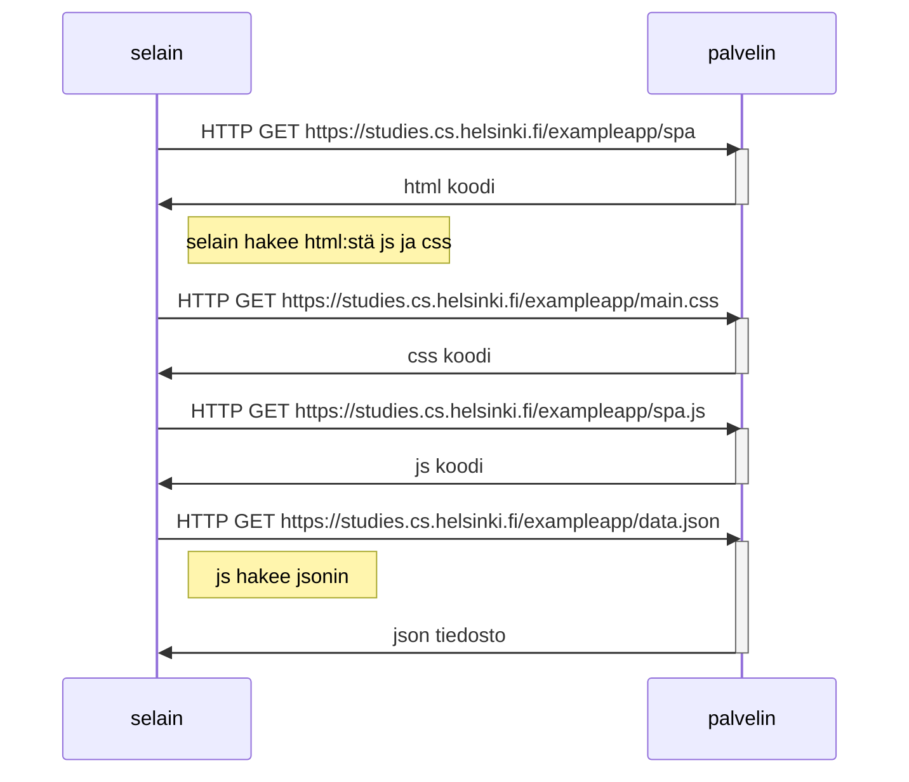

```mermaid
sequenceDiagram
participant selain 
participant palvelin
  
  selain->>palvelin: HTTP GET https://studies.cs.helsinki.fi/exampleapp/spa
  activate palvelin
  palvelin->>selain: html koodi
  deactivate palvelin
note right of selain: selain hakee html:stä js ja css
  
  selain->>palvelin: HTTP GET https://studies.cs.helsinki.fi/exampleapp/main.css
  activate palvelin
  palvelin->>selain: css koodi
  deactivate palvelin
  
  selain->>palvelin: HTTP GET https://studies.cs.helsinki.fi/exampleapp/spa.js
  activate palvelin
  palvelin->>selain: js koodi
  deactivate palvelin


  
  selain->>palvelin: HTTP GET https://studies.cs.helsinki.fi/exampleapp/data.json

  activate palvelin
note right of selain: js hakee jsonin
  palvelin->>selain: json tiedosto
  deactivate palvelin

```
